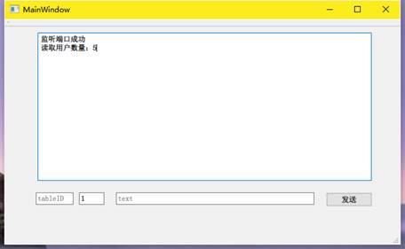
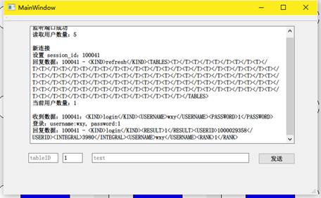
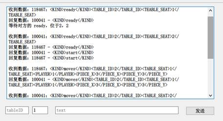

多人在线五子棋对战平台 服务端
===

服务端主要用于数据存储和数据传输，无需手动干预，故界面仅由两部分组成，一是日志控件，二是调试控件。

服务端在启动时会读取文件中存储的用户信息：用户ID、昵称、密码、排名，依次添加进一个封装后的UserInfo类，并且使用List构成一个用户数组，包含了所有的用户信息。打印用户数量至日志控件。

在日志控件下面，是一排水平放置的调试功能的空间布局，分别是游戏桌ID、座位号、发送的数据文本。这片布局仅仅用来开发时进行调试，根据传输的数据和客户端的反应来判断逻辑有没有出错。目前已经完成了其调试的使命，暂时不需要理睬。

在服务端界面中，可以看到所有传输的数据，例如下图新的客户端进入与登录的XML格式的数据。

如上图，客户端启动后设置唯一的sessionID给客户端，并且保持连接。同时获取到所有游戏桌的玩家状态，用<T>标签包裹起来，返回给客户端，最后到客户端的游戏大厅中刷新，有人的座位变黑，并且显示相应位置的玩家昵称。

在注册/登录后获取到账号密码，与用户列表中的信息进行匹配，如果登录成功就返回1，登录失败则返回0。图中的数据是登录成功，于是在`<KIND>login</KIND>`XML文本中标记了RESULT为1，并且添加上了存储在服务端的用户信息返回给客户端。客户端读取后显示在自己的界面之上展示给用户。

上图是双方玩家准备完毕后的收发的数据，所有文本皆显示在上面。一个玩家准备，发送结果给游戏桌对面的玩家。如果双方都已经准备好了，则发送`<KIND>start</KIND>`内容给双方，开始游戏。每一个落子的信号也是封装在一个`<KIND>moves</KIND>`文本之中，同时这串文本带有落子的位置，服务端收到落子信号后转发给游戏桌对面的玩家，对面玩家客户端收到信号后游戏界面存放五子棋数据的数据设置相应的位置为对方棋子，然后进入下一轮，即对方落子。接着对方也发送信号过来，继续互相传输落子数据，直至游戏结束。